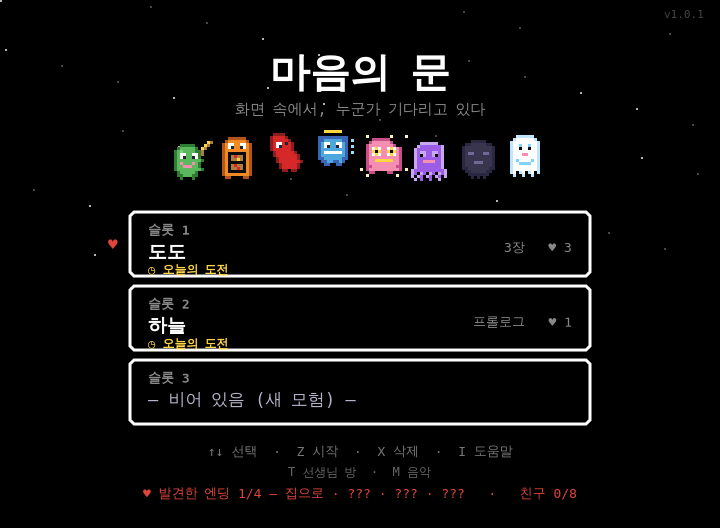
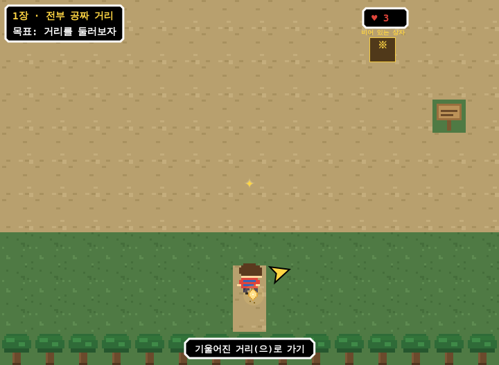
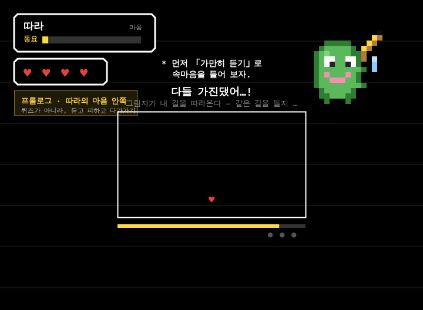
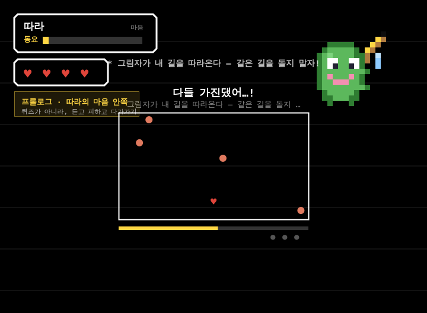
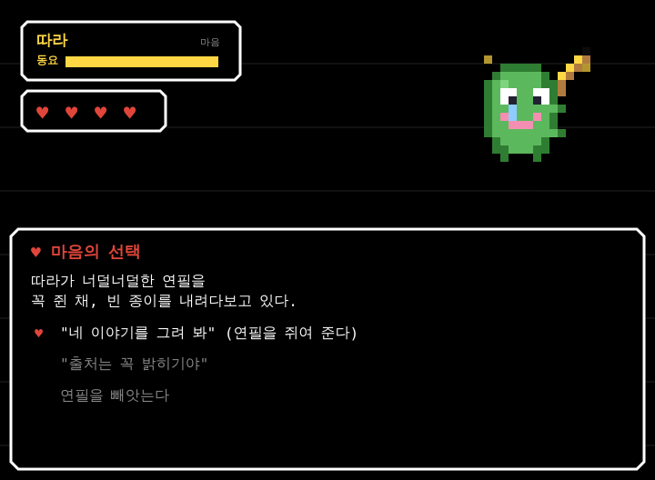
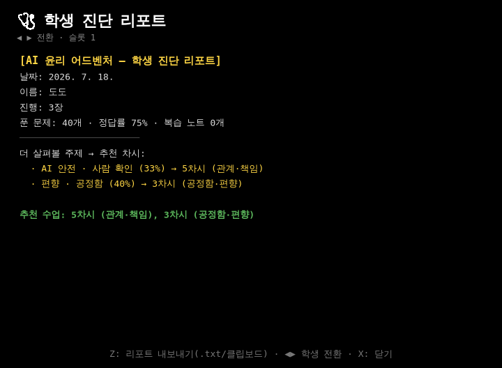

# 마음의 문 — 교사 온보딩 (5분)

> 초등 고학년 AI·디지털 윤리 교육 게임 「마음의 문」을 수업에 쓰기 위한 5분 안내서입니다.
> 설치가 필요 없고(브라우저만 있으면 됩니다), 인터넷이 끊겨도 돌아가며, 학생 기록은
> 전부 그 기기 안에만 남습니다. 아래 여섯 장면만 알면 바로 수업에 들일 수 있어요.
>
> 화면 이미지는 `tools/onboarding-shots.js`가 자동으로 만든 실제 게임 캡처입니다
> (다시 만들려면 `node tools/onboarding-shots.js`). 경로는 이 문서 기준 상대 경로예요.

---

## 1. 타이틀 — 시작점

처음 열면 세이브 슬롯 세 칸이 보입니다. 한 대의 태블릿을 세 학생이 나눠 쓸 수 있게
슬롯을 나눠 두었어요(슬롯을 지워도 되살리기 안전망이 30일간 유지됩니다). 화면 아래
여덟 조각(등장인물)이 떠다니고, 발견한 엔딩과 만난 친구 수가 함께 표시됩니다. 교사용
기능은 오른쪽 아래 「선생님」 버튼(키보드 T)으로만 열려, 학생 화면에는 교사 어휘가
노출되지 않습니다(스텔스 교육 원칙).

## 2. 방탈출 거리 탐험 — 본편의 뼈대

본편은 퀴즈가 아니라 **방탈출형 탐험**입니다. 학생은 거리를 자유롭게 걸어 다니며 문과
장치, 이상한 흔적과 단서를 조사합니다(모든 것을 조사할 수 있고, 조사할 때마다 짧은
독백이 뜹니다). 각 거리는 한 가지 디지털 윤리 주제(1장 개인정보, 2장 경청·편향,
3장 가짜 정보, 4장 절제·다크패턴, 5장 관계·책임)를 몸으로 겪게 설계돼 있어요. 길을
막는 잠금과 이상현상을 풀면 그 거리의 '조각(등장인물)'에게 다가가게 됩니다.

## 3. 듣기 — 설득 배틀의 시작

조각을 마주하면 **설득 배틀(마음 조각 배틀)**이 열립니다. 승패도 HP도 없고, 마음이
'열림' 또는 '잠시 물러남'만 있습니다. 내 턴에는 [말 걸기·증거·가만히 듣기·마음 안아
주기] 중 하나를 고르고, 상대 턴에는 상대의 마음이 '파도(탄막)'로 쏟아집니다. 「가만히
듣기」로 상대의 속마음을 먼저 들어야 대화의 실마리가 열려요. 파도를 끝까지 들어 주면
마음 게이지(위쪽 노란 막대)가 조금씩 찹니다.

## 4. 패턴 — 보스의 이름이 곧 규칙

각 조각의 상대 턴에는 그 인물을 상징하는 **고유 패턴**이 있습니다. 첫 상대 「따라」는
「그림자 하트」 — 내가 지나온 자취를 그대로 따라오는 그림자라, 같은 길을 맴돌면 잡히고
새 길을 그리면 그림자가 지칩니다("남 따라 하지 않기"의 은유). 이후 인물들도 이름이 곧
규칙입니다(정보 꾸러미 돌려주기, 저울의 반례 담기, 확률표 읽고 유혹 버티기, 원본과
대조해 참·거짓 가리기 등). 첫 등장 파도는 **다치지 않는 연습 파도**라, 학생이 규칙을
안전하게 익힌 뒤 실전으로 넘어갑니다.

## 5. 자비 — 마음을 안아 주기

게이지가 가득 차면 상대의 이름이 노랗게 물들고(spareReady), 「마음 안아 주기」로만
배틀을 끝낼 수 있습니다. 마지막 두 칸은 반드시 '대답'(상대의 말을 이해했다는 표시)으로만
채워지도록 설계돼, 몸으로 피하기만 해서는 끝나지 않고 **읽고 이해해야** 마음이 열립니다.
안아 준 인물은 세계에 '친구'로 남아 경계마을로 이사 옵니다. 이 선택들이 모여 네 가지
엔딩으로 갈라져요.

## 6. 리포트 — 수업으로 잇기

「선생님 방」에는 교사 도구가 모여 있습니다. **학생 진단 리포트**는 학생이 약한 주제를
찾아 다음 차시(활동지)로 연결해 주고, **반 순위표**는 여러 기기의 데이터 백업(.json)을
불러와 학급 전체를 한 표(이름·안아준 마음·정답률·S등급)로 모아 CSV로 내보냅니다.
수업 모드로 특정 장을 바로 시작할 수 있고, 시작 전 **사전 점검 5문항**과 보스 클리어 후
**사후 점검**(옵트인·스킵 가능)으로 그 차시의 향상도를 확인할 수 있어요. 모든 기록과
CSV는 네트워크 없이 그 기기 안에서만 처리됩니다(개인정보 보호).

---

### 30초 요약

1. 태블릿을 열고 빈 슬롯을 골라 학생 이름을 넣습니다.
2. 거리를 탐험하며 문·장치·단서를 조사해 조각에게 다가갑니다.
3. 설득 배틀에서 듣고 → 패턴을 익히고 → 마음을 안아 줍니다.
4. 수업 후 「선생님 방」의 리포트·반 순위표·사전/사후 점검으로 배움을 확인합니다.

문의: 프로젝트 저장소(README) · 자세한 데이터·규칙은 `docs/기준서-방탈출-리부트.md`.
